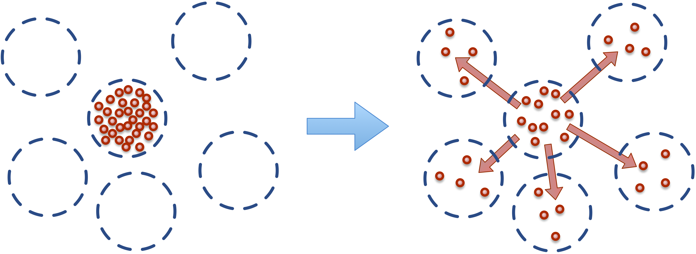

.. _flux:

Chemical Reactions, Flux and Transport
---------------------------------------

.. py:currentmodule:: mechanica

Mechanica supports modeling and simulation of fluids using
Dissipative Particle Dynamics (DPD), where each particle represents a 'parcel' of
a real fluid. A single DPD particle typically represents anywhere from a cubic
micron to a cubic mm, or about :math:`3.3 \times 10^{10}` to :math:`3.3 \times
10^{19}` water molecules. DPD particle interactions are implemented in
Mechanica using the :ref:`dpd potential <potentials>`.

Building on DPD capabilities, Mechanica also supports attaching diffusive chemical
solutes to DPD-like particles using Transport Dissipative Particle Dynamics
(tDPD), where each tDPD particle represents a parcel of bulk fluid with a set
of chemical solutes at each particle. Chemical solutes in Mechanica are referred
to as *species*. In tDPD, a particle represents a parcel of the bulk medium, or
the 'solvent', and each tDPD particle carries along, or advects, attached solutes.
Solutes can diffuse between nearby tDPD particles, and can be created and destroyed
through various reaction processes.

In general, the time evolution of a chemical species attached to the
:math:`i\mathrm{th}` particle :math:`S_i` is given as:

.. math::

   \frac{dS_i}{dt} = \sum_{i \neq j} Q^T_{ij} +Q^R_i,

where the rate of change of the chemical species attached to a particle is equal
to the sum of the transport flux :math:`Q^T` and local reactions :math:`Q^R_i`.

Species can be added to a particle type by simply adding a
:attr:`species <ParticleType.species>` attribute to a particle type class
definition and assigning a list of names, each of which names a species.
Mechancia automatically instantiates each corresponding particle of the particle
type with a species of each specified name. ::

    import mechanica as mx

    class AType(mx.ParticleType):
        species = ['S1', 'S2', 'S3']

An instance of a particle type with attached chemical species has a vector of
chemical species attached to it, which is accessible via the attribute
:attr:`species <MxParticleType.species>`. Likewise each particle with attached
chemical species has a state vector with a value assigned to each attached species,
which is also accessible via the attribute :attr:`species <MxParticleHandle.species>`. ::

    A = AType.get()
    print(A.species)  # prints SpeciesList(['S1', 'S2', 'S3'])
    a = A()
    print(a.species)  # prints StateVector([S1:0, S2:0, S3:0])

:py:attr:`SpeciesList` (:class:`MxSpeciesList` in C++) is a special list of SBML
species definitions. :py:attr:`SpeciesList` can also be created with additional
information about the species by instantiating with instances of the Mechanica
class :py:attr:`Species` (:class:`MxSpecies` in C++).

The state vector of type :py:attr:`StateVector` (:class:`MxStateVector` in C++)
attached to each particle is array-like but, in addition to the numerical
values of the species, also contains metadata of the species
definitions. The concentration of a particular species in a particle can be
accessed by index or name. ::

    print(a.species[0])  # prints 0.0
    a.species.S1 = 1
    print(a.species[0])  # prints 1.0
    a.species[0] = 5
    print(a.species.S1)  # prints 5.0

.. _species-label:

Working with Species
^^^^^^^^^^^^^^^^^^^^^

By default, Mechanica creates :py:attr:`Species` instances that are
*floating* species, or species with a concentration that varies in time, and
that participate in reaction and flux processes. However, Mechanica also
supports other kinds of species such as *boundary* species, as well as additional
information about the species like its initial values.

The Mechanica :py:attr:`Species` class is *essentially* a wrap around the
`libSBML <https://sbml.org/software/libsbml/>`_ ``Species`` class, but
provides some conveniences in generated languages. For example, in Python Mechanica
uses convential Python `snake_case` sytax, and all SBML Species properties are
avialable via simple properties on a Mechanica :py:attr:`Species` object. Many SBML
concepts such as `initial_amount`, `constant`, etc. are optional features in
Mechanica that may or may not be set. For example, to set an initial concentration
on a :py:attr:`Species` instance ``s``, ::

    s.initial_concentration = 5.0

Such operations internally update the libSBML Species instance contained within
the Mechanica :py:attr:`Species` instance, and Mechanica will use the information
accordingly. In the case of :attr:`initial_concentration <MxSpecies.initial_concentration>`,
the value determines the initial concentration of created particles when the
:py:attr:`Species` belongs to a particular particle type. Likewise, setting the
attribute :attr:`constant <MxSpecies.constant>` of a
:py:attr:`Species` belonging to a particle type to ``True`` makes all created
particles of that type maintaing a constant concentration (and for a particular
particle when the :py:attr:`Species` instance belongs to a particle), ::

    # Make all particles of type 'a' have constant concentration...
    a.species.S1.constant = True
    # ... except let this one vary
    a_part = a()
    a_part.species.species.S1.constant = False

In the simplest case, a Mechanica :py:attr:`Species` instance can be created by
constructing with only the name of the species. ::

    s = mx.Species("S1")

A species can be made a ``boundary`` species (*i.e.*, one that acts like a boundary
condition) by adding ``"$"`` in the argument. ::

    bs = mx.Species("$S2")
    print(bs.id)        # prints 'S2'
    print(bs.boundary)  # prints True

The :py:attr:`Species` constructor also supports specifying initial values,
which can be made using an equality statement. ::

    ia = mx.Species("S3 = 1.2345")
    print(ia.id)              # prints 'S3'
    print(ia.initial_amount)  # prints 1.2345

When constructing a :py:attr:`SpeciesList` with :py:attr:`Species` instances, an empty
:py:attr:`SpeciesList` instance is first created, to which :py:attr:`Species` instances
are appended using the :py:attr:`SpeciesList` method :meth:`insert <MxSpeciesList.insert>`. ::

    s_list = mx.SpeciesList()
    s_list.insert(s)
    s_list.insert(ia)
    print(s_list)  # prints SpeciesList(['S1', 'S3'])

Each species in a :py:attr:`SpeciesList` instance can be accessed using the
:py:attr:`SpeciesList` method :meth:`item <MxSpeciesList.item>`. ::

    print(s_list.item("S1").id)  # prints 'S1'

.. _flux-label:

Spatial Transport
^^^^^^^^^^^^^^^^^^

Recall that the DPD-like particles in Mechanica (and in general) represent a
parcel of fluid. Mechanica tDPD modeling provides a natural way of modeling
*advection* by the mere motion of particles carrying species. Furthermore,
Mechanica also provides the ability to model the tendency of dissolved
chemical solutes in each parcel of fluid to *diffuse* to nearby locations,
which results in mixing or mass transport without directed
bulk motion of the solvent. Modeling *convection* in Mechanica is then the
combination of transporting species along with tDPD particles (*i.e.*,
advection) and between tDPD particles (*i.e.*, diffusion).

    Dissolved solutes have a natural tendency to diffuse to nearby locations. 

A *flux* describes the transport of species between particles. Fluxes are
similar to pair-wise forces between particles, in that a flux transports
a particular species between nearby particles of particular particle types.
A flux that implements a Fickian diffusion process of chemical species located
at particles can be created with the static method :meth:`flux <MxFluxes.flux>`
on a top-level class :py:attr:`Fluxes` (:class:`MxFluxes` in C++). Mechanica
implements a diffusion process of chemical species located at particles using
the basic passive (Fickian) flux type, with :meth:`flux <MxFluxes.flux>`. Fickian
flux implements a diffusive transport of species concentration :math:`S` located
on a pair of nearby objects :math:`a` and :math:`b` with the analogous reaction:

.. math::

    \begin{align*}
    a.S \leftrightarrow b.S &; k \left(1 - \frac{r}{r_{cutoff}} \right)\left(a.S - b.S\right)     \\
    a.S \rightarrow 0   &; \frac{d}{2} a.S \\
    b.S \rightarrow 0   &; \frac{d}{2} b.S,
    \end{align*}

Here :math:`a.S` is a chemical species located at object :math:`a`, and likewise
for :math:`b`, :math:`k` is the flux constant, :math:`r` is the
distance between the two objects, :math:`r_{cutoff}` is the global cutoff
distance, and :math:`d` is the optional decay term.

Fickian diffusion can be implemented on the basis of species and pair of particle
types. ::

    class AType(mx.ParticleType)
        species = ['S1']

    class BType(mx.ParticleType)
        species = ['S1', 'S2']

    A = AType.get(); B = BType.get()

    mx.Fluxes.flux(A, A, 'S1', 5.0)

Likewise, decay can also be assigned as an optional fourth argument. ::

    mx.Fluxes.flux(B, B, 'S2', 7.5, 0.005)

Production and Consumption
^^^^^^^^^^^^^^^^^^^^^^^^^^^

Mechanica supports modeling active pumping for applications like membrane
ion pumps, or other forms of active transport with the methods
:meth:`secrete <MxFluxes.secrete>` and :meth:`uptake <MxFluxes.uptake>`,
which are also defined on :py:attr:`Fluxes`.

The :meth:`secrete <MxFluxes.secrete>` flux implements the reaction:

.. math::

   \begin{align*}
   a.S \rightarrow b.S &;  k \left(1 - \frac{r}{r_{cutoff}} \right)\left(a.S - a.S_{target} \right) \\
   a.S \rightarrow 0   &;  \frac{d}{2} a.S \\
   b.S \rightarrow 0   &;  \frac{d}{2} b.S
   \end{align*}

The :meth:`uptake <MxFluxes.uptake>` flux implements the reaction:

.. math::

   \begin{align*}
   a.S \rightarrow b.S &; k \left(1 - \frac{r}{r_{cutoff}}\right)\left(b.S - b.S_{target} \right)\left(a.S\right) \\
   a.S \rightarrow 0   &; \frac{d}{2} a.S \\
   b.S \rightarrow 0   &; \frac{d}{2} b.S
   \end{align*}

Here :math:`S_{target}` is a target concentration, and all other symbols are
as previously defined. Note that changes in sign due to the difference of the
present and target concentrations are permissible. Both methods require the
same arguments as :meth:`flux <MxFluxes.flux>` and a fourth argument defining
the target concentration. ::

    mx.Fluxes.secrete(A, B, 'S1', 10.0, 1.0)

An optional decay term can also be included for both methods as a fifth argument. ::

    mx.Fluxes.uptake(B, A, 'S1', 10.0, 1.0, 0.001)

Species can also be secreted directly from a particle to its surroundings.
A species attached to a particle has a method :meth:`secrete <MxFluxes.secrete>`
that takes the argument of an amount to be released over the current time step. ::

    a = A()
    a.species.S1.secrete(10.0)

The neighborhood to which a species is secreted can be explicitly defined by distance
from a particle using the keyword argument ``distance``. ::

    b = B()
    b.species.S1.secrete(5.0, distance=1.0)

The neighborhood can also be defined in terms of particles by passing a
:py:attr:`ParticleList` instance to the keyword argument ``to``. ::

    b.species.S1.secrete(5.0, to=b.neighbors())
