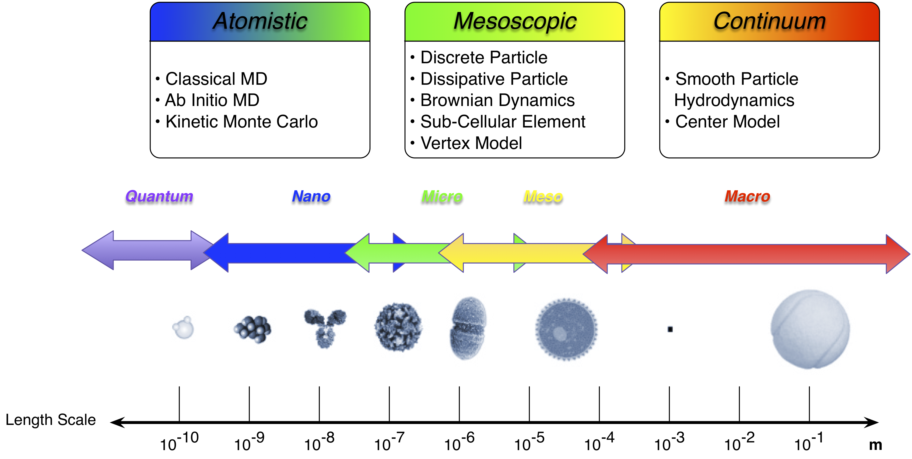
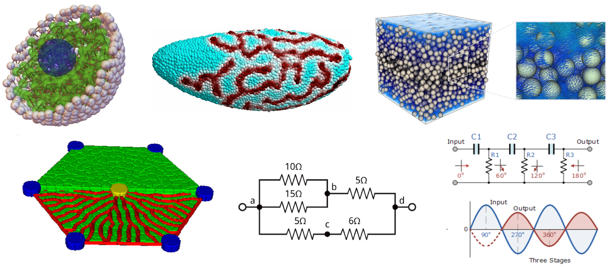

.. _introduction:

Introduction
=============

Biological cells are the prototypical example of active matter.
Cells are actively driven agents that transduct free energy from their environment.
These agents can sense and respond to mechanical, chemical and electrical
environmental stimuli with a range of behaviors, including dynamic changes in
morphology and mechanical properties, chemical uptake and secretion, cell
differentiation, proliferation, death, and migration.
One of the greatest challenges of quantitatively modeling cells is that
descriptions of their dynamics and behaviors typically cannot be derived from first principles.
Rather, their observed behaviors are typically described phenomenologically or empirically.
Thus, those who explore the properties of cells and processes of subcellular,
cellular and tissue dynamics require an extreme degree of flexibility to propose
different kinds of interactions at various scales and test them in virtual experiments.

The need for extreme flexibility of model implementation and simulation presents
a significant challenge to the development of a modeling and simulation environment.
As a simulation environment simplifies the process of writing and simulating models
(*e.g.*, without resorting to hard-coding and building C++ or FORTRAN), the level of
flexibility in writing and simulating a model tends to decrease.
For example, if a user wants to write a standard molecular dynamics
model, there are many excellents choices of simulation engines available, and
these kinds of models can easily be specified by human readable configuration files.
However, when an interaction is not well standardized or formalized
(*e.g.*, those of cells, organelles and biomolecules), the user is almost always left to
hard-coding and building custom software, thus eliminating the value of the simplified
simulation interface.

    Particle Dynamics enables modeling a wide range of length scales

The goal of the Mechanica project is to deliver a modeling and simulation framework
that lets users from all relevant backgrounds interactively create, simulate and
explore models at biologically relevant length scales.
We believe that accessible and interactive modeling and simulation is key to increasing
scientific productivity, much like how modeling environments have revolutionized
many fields of modern engineering.

We thus present Mechanica, an interactive modeling and simulation environment
based on an off-lattice formalism that seeks to allow users to create models for a wide range of
biologically relevant problems using any combination of the following modeling methodologies:

* Coarse Grained Molecular Dynamics
* Discrete Element Method (DEM). DEM particles add rotational degrees-of-freedom
  as well as stateful contact and often complicated geometries (including
  polyhedra).
* Dissipative Particle Dynamics (DPD). A particle-based method, where particles
  represent whole molecules or fluid regions rather than single atoms, and
  atomistic details are not considered relevant to the processes addressed. The
  particles' internal degrees of freedom are averaged out and represented by
  simplified pairwise dissipative and random forces, so as to conserve momentum
  locally and ensure correct hydrodynamic behavior. DPD allows much longer time
  and length scales than are possible using conventional MD simulations.
* Sub-Cellular Element (SCM). Frequently used to model complex sub-cellular
  active mechanics. SCM is similar to DPD, where each particle represents a
  region of space and is governed by empirically derived potentials, but adds
  active response.
* Smoothed particle hydrodynamics (SPH). A particle method very similar to DPD and
  frequently used to model complex fluid flows, especially large fluid
  deformations, fluid-solid interactions, and multi-scale physics.
* Reactive Molecular Dynamics. In RMD, particles react with other particles and
  form new molecules, and can absorb or emit energy into their environment.
  Mechanica is designed to support reactive particles, as one of our main goals is
  very efficient particle creation and deletion. Very few classical molecular
  dynamics packages support reactive MD, as they are almost all highly optimized
  towards conserved number of particles.
* Flux Networks. The concept of a flux is extremly general, and this lets us
  define a *connector* type that lets users connect different model
  elements. Flux networks allow us to define a wide range of problems,
  from biological fluid flow in areas like the liver and the eye, to
  physiologically based pharmacokinetic (PBPK) modeling, and  even to electric
  circuits and pipe flow networks.
* Reaction Diffusion. Mechanica allows users to attach a chemical cargo to
  each particle, host a chemical reaction network at each particle, and
  transport *between* particles.
* Event-based modeling. Mechanica supports attaching custom handlers of a
  variety of different *events* that particles (or other objects) can emit.
  Therefore, Mechanica also supports developing full *Transport Dissipative Particle
  Dynamics* simulations.

.. warning:: Only a subset of these features are presently available. We encourage users
    to **contact us about what features would best benefit your specific problem**.
    Please contact us at `<mechanicasim@gmail.com>` or raise an issue on the
    `Mechanica repository <https://github.com/tjsego/mechanica>`_.

As development of Mechanica progresses, existing *Vertex Model* capabilities
will also be introduced into Mechancia. Vertex Model is another specialized form
of classical Molecular Dynamics, but with instead of the traditional bonded
relationships of bonds, angles, dihedrals, impropers, Vertex Models add some
new kinds of bonded relationships such as polygons and volumes to represent surface
and volume forces.

    The kinds of modeling and simulation problems Mechanica is designed to enable.
