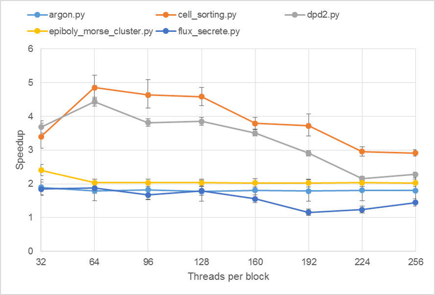

.. _cuda:

GPU Acceleration
=================

Mechanica supports modular, runtime-configurable GPU acceleration of a simulation using CUDA.
Computational features of Mechanica that support GPU-acceleration can be configured, offloaded to
a GPU, brought back to the CPU and reconfigured at any time during a simulation.
For Mechanica installations with enabled GPU acceleration, no computations are performed on a GPU by default.
Rather, GPU-supporting features of Mechanica must be explicitly configured and offloaded to a GPU
using their corresponding interactive interface.
This modular, configurable approach allows fine-grain control of computations to acheive maximum performance
for a given set of hardware *and* a particular simulation.

For example, suppose a simulation begins with a few hundred particles. Such a simulation would likely not
benefit from GPU acceleration (or even run slower on a GPU). However, suppose that over the course of the
simulation, hundreds of thousands of :ref:`particles are created <creating_particles_and_types>`.
At some point, this simulation will run faster on a GPU. Mechanica easily handles such a situation by
allowing the computations of the particle interactions to be offloaded to a GPU mid-execution of the
simulation (and brought back to the CPU, should the particle number significantly decrease).

Deployment on a GPU is best accomplished when running Mechanica in
:ref:`windowless mode <running_a_sim_windowless>`, since real-time rendering of interactive
Mechanica simulations also utilizes available GPUs.

.. note::

    Mechanica currently supports acceleration using a single GPU.
    Future releases will support deploying computations on multiple GPUs by computational feature.

Mechanica includes a flag to check whether GPU acceleration is supported by the installation
(:meth:`mxHasCuda` in C++), ::

    import mechanica as mx

    print(mx.has_cuda)  # True if GPU acceleration is installed; False otherwise

GPU-Accelerated Simulator
^^^^^^^^^^^^^^^^^^^^^^^^^^

:class:`Simulator` provides access to runtime control of GPU-accelerated simulaton features.
Each GPU-accelerated simulation feature has its own runtime control interface for configuring and
deploying on a GPU. GPU runtime control of simulation modules can be accessed directly from
:class:`Simulator`, ::

    cuda_config_sim: mx.MxSimulatorCUDAConfig = mx.Simulator.getCUDAConfig()

The returned :class:`MxSimulatorCUDAConfig` provides convenient access to all current GPU-accelerated
simulation features.

GPU-Accelerated Engine
^^^^^^^^^^^^^^^^^^^^^^^

Engine GPU acceleration is a GPU-accelerated simulation feature that offloads nonbonded potential
interactions, fluxes, particle sorting and space partitioning onto a GPU.
All runtime controls of engine GPU acceleration are available on :class:`MxEngineCUDAConfig`, which is
an attribute with name ``engine`` on :class:`MxSimulatorCUDAConfig`, ::

    cuda_config_engine = mx.Simulator.getCUDAConfig().engine  # Get engine cuda runtime interface

Engine GPU acceleration can be enabled, disabled and customized during simulation according to hardware
capabilities and simulation state, ::

    cuda_config_engine.setBlocks(numBlocks=64)                # Set number of blocks
    cuda_config_engine.setThreads(numThreads=32)              # Set number of threads per block
    cuda_config_engine.toDevice()                             # Send engine to GPU
    # Simulation code here...
    if cuda_config_engine.onDevice():                         # Ensure engine is on GPU
        cuda_config_engine.fromDevice()                       # Bring engine back from GPU

Setting a number of blocks specifies the maximum number of CUDA thread blocks that can be deployed
during a simulation step, which work on various engine tasks (*e.g.*, calculating interactions among
particles in a subspace of the simulation space).
Setting a number of threads per block specifies the number of threads launched per block to work on each
engine task.

    Speedup from GPU acceleration using a NVIDIA GeForce GTX 750 Ti compared to multithreading with 8
    cores on an Intel i7-4790K. Error bars show three standard deviations upward and downward from ten
    trials of each example script.

Many Mechanica operations automatically update data when running on a GPU.
However, some operations (*e.g.*, :ref:`binding <binding>` a :class:`Potential`)
require manual refreshing on engine data for changes to be reflected when running on a GPU.
Engine GPU acceleration runtime control provides methods to explicitly tell Mechanica to
refresh data on a GPU at various levels of granularity, ::

    cuda_config_engine.refreshPotentials()          # Capture changes to potentials
    cuda_config_engine.refreshFluxes()              # Capture changes to fluxes
    cuda_config_engine.refreshBoundaryConditions()  # Capture changes to boundary conditions
    cuda_config_engine.refresh()                    # Capture all changes

Refer to the :ref:`Mechanica API Reference <api_reference>` for which operations automatically update
engine data on a GPU.

.. note::

    It's not always clear what changes are automatically detected by Mechanica
    when running on a GPU. When in doubt, refresh the data! Performing a refresh comes with
    additional computational cost but must be performed only after all changes to simulation data
    have been made, and before the next simulation step is called.
